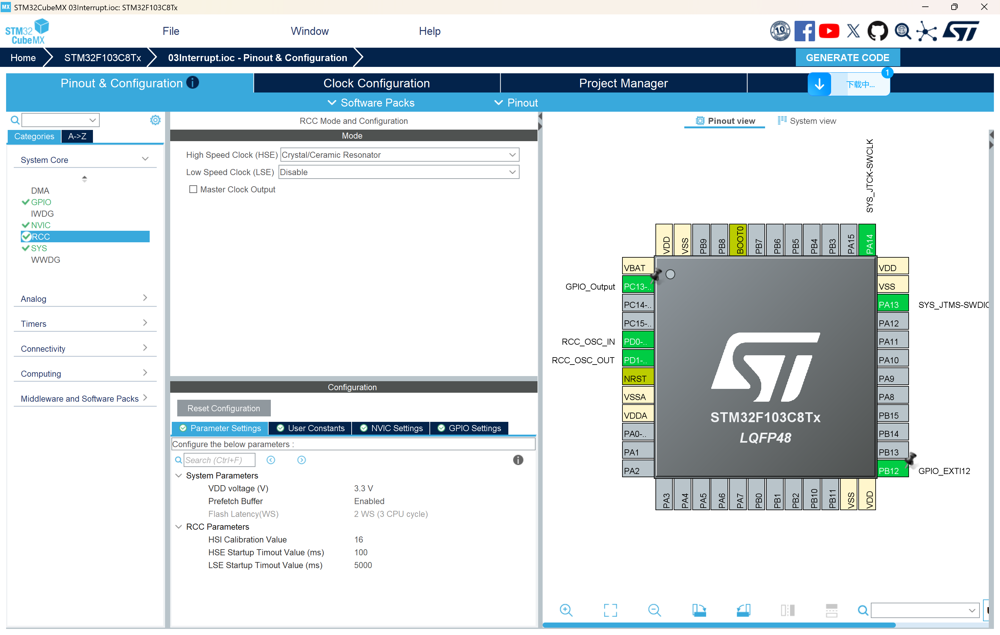
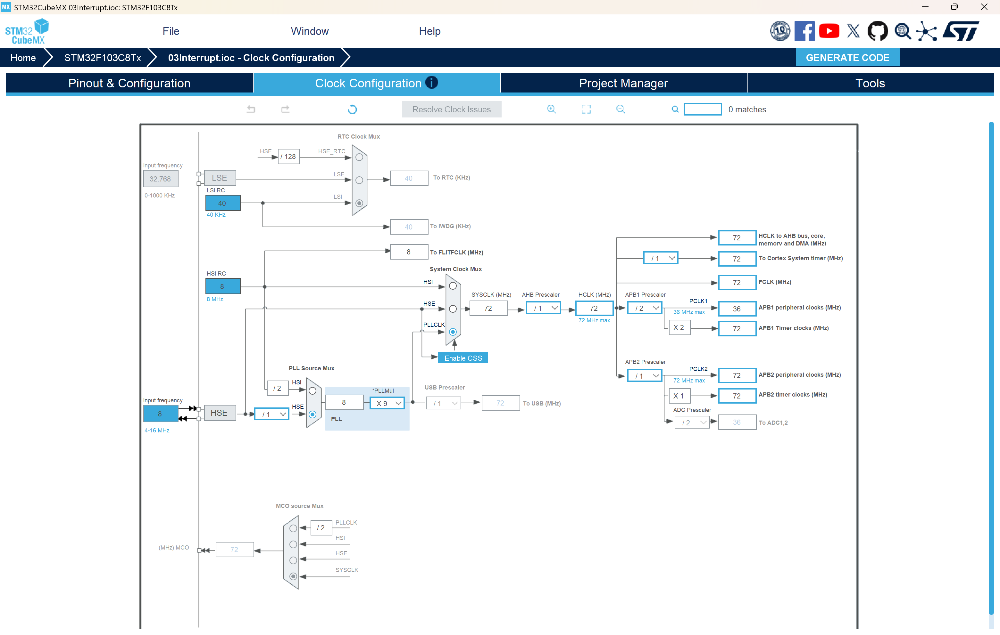
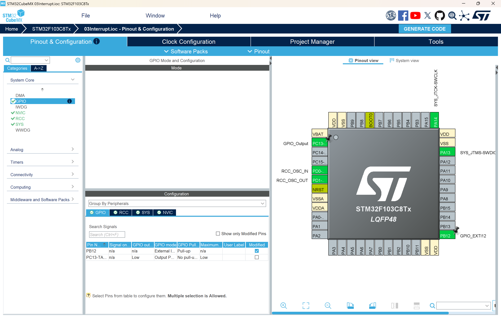

# 作业3：STM32中断实验

## 统一作业说明

### 学生需要完成的核心任务

1. 使用 STM32CubeMX 完成 GPIO 外部中断、NVIC、时钟等配置，并保留可重新生成代码的 `.ioc` 文件。
2. 基于 HAL 库完成 PB12 外部中断控制 PC13 LED 的程序编写。
3. 实现基础的软件去抖动逻辑，并能够解释其工作原理。
4. 成功编译、下载并验证中断触发、LED 翻转和去抖动效果。
5. 在实验报告中完整说明配置步骤、关键代码、实验现象、调试过程和课后作业答案。
6. 按 [00Template/README.md](../00Template/README.md) 中提供的 LaTeX 模板撰写中文实验报告并提交 PDF。

### 本次作业验收目标

| 项目 | 要求 |
|------|------|
| 处理器平台 | STM32F103C8T6 |
| 输入对象 | PB12 外部中断 |
| 输出对象 | PC13 LED |
| 必做功能 | PB12 下降沿触发中断，LED 翻转，200 ms 内重复触发不重复响应 |
| 理论要求 | 能解释 EXTI、NVIC、中断回调和软件去抖动 |
| 验收方式 | 现场演示或结果图片/截图，能够证明中断响应和去抖动有效 |

### 本次必须提交的内容

1. 可编译的完整工程目录。
2. 一份 PDF 格式实验报告。
3. CubeMX 配置截图、关键中断代码截图、实验现象图片各至少 1 张。
4. 课后作业题的完整书面回答。

### 报告必须回答的问题

1. 为什么 PB12 要配置为下降沿触发和上拉输入。
2. EXTI12、EXTI15_10_IRQn 与 `HAL_GPIO_EXTI_Callback()` 之间是什么关系。
3. 为什么中断服务程序中不宜执行复杂业务逻辑。
4. 去抖动阈值设置过大或过小分别会带来什么问题。

## 一、实验目的

1. 掌握STM32外部中断（EXTI）的配置和使用方法
2. 理解中断的工作原理和中断优先级机制
3. 学习使用HAL库进行中断编程
4. 掌握按键去抖动的软件实现方法
5. 理解中断服务函数和回调函数的关系

## 二、实验原理

### 2.1 什么是中断？

中断是一种异步事件处理机制。当某个事件发生时（如按键按下、定时器溢出等），CPU会暂停当前正在执行的程序，转而去执行与该事件相关的中断服务程序（ISR），处理完成后再返回原来的程序继续执行。

**中断的优势：**
- 实时响应：能够快速响应外部事件
- 提高效率：CPU不需要一直轮询检查事件是否发生
- 降低功耗：CPU可以进入低功耗模式，等待中断唤醒

### 2.2 STM32的EXTI（外部中断/事件控制器）

STM32F103C8T6的EXTI模块具有以下特点：
- 支持19个外部中断/事件线（EXTI0-EXTI18）
- 每个GPIO引脚都可以配置为外部中断源
- 支持上升沿、下降沿或双边沿触发
- 可配置中断优先级

**EXTI线与GPIO的对应关系：**
- EXTI0对应所有GPIO的Pin0（PA0, PB0, PC0...）
- EXTI1对应所有GPIO的Pin1（PA1, PB1, PC1...）
- ...以此类推
- EXTI12对应所有GPIO的Pin12（PA12, PB12, PC12...）

**中断向量分组：**
- EXTI0-EXTI4：每个线有独立的中断向量
- EXTI5-EXTI9：共享EXTI9_5_IRQn中断向量
- EXTI10-EXTI15：共享EXTI15_10_IRQn中断向量

本实验使用PB12，对应EXTI12，属于EXTI15_10中断线。

### 2.3 中断处理流程

```
外部事件发生（PB12下降沿）
    ↓
硬件检测到触发条件
    ↓
EXTI12中断标志位置位
    ↓
NVIC判断中断优先级
    ↓
CPU保存当前状态，跳转到中断向量表
    ↓
执行EXTI15_10_IRQHandler()
    ↓
调用HAL_GPIO_EXTI_IRQHandler()
    ↓
清除中断标志位
    ↓
调用HAL_GPIO_EXTI_Callback()（用户回调函数）
    ↓
执行用户代码（LED翻转）
    ↓
返回主程序
```

### 2.4 按键去抖动原理

机械按键在按下和释放时，由于机械弹性作用，会产生抖动信号，导致多次触发中断。

**抖动特点：**
- 持续时间：通常5-10ms
- 表现形式：在按下瞬间产生多个脉冲

**软件去抖动方法：**
使用时间戳记录上次中断时间，只有当两次中断间隔超过设定阈值（如200ms）时，才认为是有效按键。

## 三、硬件连接

### 3.1 使用的IO口

| 引脚 | 功能 | 配置 | 说明 |
|------|------|------|------|
| PC13 | LED输出 | 推挽输出 | 低电平点亮LED |
| PB12 | 按键输入 | 上拉输入+外部中断 | 下降沿触发 |

### 3.2 连接方式

**方式一：使用按键**
- 按键一端连接PB12
- 按键另一端连接GND
- 按下按键时，PB12被拉低，产生下降沿

**方式二：使用杜邦线**
- 用杜邦线短接PB12和GND
- 每次接触产生下降沿触发中断

**LED连接：**
- PC13通常板载连接LED
- 低电平点亮，高电平熄灭

## 四、STM32CubeMX详细配置步骤

### 4.1 创建新工程

1. **启动STM32CubeMX**
   - 打开STM32CubeMX软件
   - 选择"File" → "New Project"

2. **选择芯片型号**
   - 在"Part Number"搜索框中输入：STM32F103C8
   - 在列表中选择"STM32F103C8Tx"
   - 点击"Start Project"

### 4.2 时钟配置（RCC）

1. **配置外部时钟源**
   - 在左侧Pinout视图中，找到"System Core" → "RCC"
   - 或在芯片引脚图中找到OSC_IN和OSC_OUT引脚

2. **设置HSE（高速外部时钟）**
   - HSE (High Speed Clock)：选择"Crystal/Ceramic Resonator"（晶振/陶瓷谐振器）
   - 这会自动配置PD0-OSC_IN和PD1-OSC_OUT引脚
   

3. **配置系统时钟树**
   - 点击顶部的"Clock Configuration"标签页
   - 在"HSE"输入框中输入：8（MHz）
   - 勾选"PLL Source Mux"选择"HSE"
   - 在"PLLMUL"（PLL倍频系数）选择"x9"
   - 在"System Clock Mux"选择"PLLCLK"
   - 最终"HCLK"应显示为72MHz
   - 如果有警告，点击"Resolve Clock Issues"自动解决
   

### 4.3 GPIO配置

#### 4.3.1 配置PC13（LED输出）

1. **在引脚图中找到PC13**
   - 在芯片引脚图中找到PC13引脚
   - 点击PC13引脚

2. **设置为GPIO输出**
   - 在弹出菜单中选择"GPIO_Output"
   - 引脚会变成绿色，表示已配置为输出

3. **配置GPIO参数**
   - 在左侧"System Core" → "GPIO"中
   - 找到PC13配置项
   - 设置如下：
     - GPIO output level：Low（初始输出低电平）
     - GPIO mode：Output Push Pull（推挽输出）
     - GPIO Pull-up/Pull-down：No pull-up and no pull-down（无上下拉）
     - Maximum output speed：Low（低速）
     - User Label：可选，输入"LED"作为标签

#### 4.3.2 配置PB12（外部中断输入）

1. **在引脚图中找到PB12**
   - 在芯片引脚图中找到PB12引脚
   - 点击PB12引脚

2. **设置为外部中断模式**
   - 在弹出菜单中选择"GPIO_EXTI12"
   - 引脚会变成黄色，表示已配置为外部中断

3. **配置GPIO参数**
   - 在左侧"System Core" → "GPIO"中
   - 找到PB12配置项
   - 设置如下：
     - GPIO mode：External Interrupt Mode with Falling edge trigger detection（下降沿触发外部中断模式）
     - GPIO Pull-up/Pull-down：Pull-up（上拉）
     - User Label：可选，输入"BUTTON"作为标签
     

**重要说明：**
- 必须选择"External Interrupt Mode"而不是"External Event Mode"
- 触发方式选择"Falling edge"（下降沿），因为按键按下时PB12从高电平变为低电平
- 必须配置上拉电阻，保证默认状态为高电平

### 4.4 NVIC配置（关键步骤）

1. **进入NVIC配置页面**
   - 在左侧"System Core" → "NVIC"
   - 或点击顶部"Configuration"按钮，然后选择"NVIC"

2. **使能EXTI中断**
   - 在"NVIC"标签页中，找到"EXTI line[15:10] interrupts"
   - **勾选"Enabled"复选框**（这一步非常重要！）
   - 设置优先级：
     - Preemption Priority：0（抢占优先级，0为最高）
     - Sub Priority：0（子优先级）

3. **Code generation选项**
   - 切换到"Code generation"标签页
   - 确认"EXTI line[15:10] interrupts"已勾选
   - 勾选"Generate IRQ handler"（生成中断处理函数）

**注意事项：**
- 如果不在NVIC中使能中断，生成的代码将不包含`HAL_NVIC_SetPriority()`和`HAL_NVIC_EnableIRQ()`
- 本工程已在gpio.c的USER CODE区域手动添加了NVIC配置，即使CubeMX未生成也能正常工作
- 但建议在CubeMX中正确配置，保持配置文件与代码一致

### 4.5 项目设置

1. **进入Project Manager**
   - 点击顶部"Project Manager"标签页

2. **Project设置**
   - Project Name：输入"03Interrupt"
   - Project Location：选择保存路径
   - Toolchain/IDE：推荐选择适合VS Code工作流的工程类型（如Makefile）
     - 推荐：VS Code + STM32CubeIDE插件（用于配置/生成/调试辅助）
     - 不推荐：STM32CubeIDE独立软件作为主开发环境
     - Makefile
     - Keil MDK-ARM
     - IAR EWARM

3. **Code Generator设置**
   - 点击左侧"Code Generator"
   - 勾选"Copy only the necessary library files"（只复制必要的库文件）
   - 勾选"Generate peripheral initialization as a pair of '.c/.h' files per peripheral"（每个外设生成独立的.c/.h文件）

### 4.6 生成代码

1. **检查配置**
   - 返回"Pinout & Configuration"检查所有配置
   - 确认PC13为GPIO_Output
   - 确认PB12为GPIO_EXTI12
   - 确认NVIC中EXTI15_10已使能

2. **生成代码**
   - 点击顶部工具栏的"GENERATE CODE"按钮（齿轮图标）
   - 或选择"Project" → "Generate Code"
   - 等待代码生成完成

3. **打开工程**
   - 生成完成后，点击"Open Project"
   - 或手动打开生成的工程文件

### 4.7 验证生成的代码

生成代码后，检查以下文件：

1. **gpio.c**
   - 确认PC13配置为GPIO_MODE_OUTPUT_PP
   - 确认PB12配置为GPIO_MODE_IT_FALLING
   - 如果NVIC配置正确，应该包含HAL_NVIC_SetPriority()和HAL_NVIC_EnableIRQ()

2. **stm32f1xx_it.c**
   - 如果NVIC配置正确，应该包含EXTI15_10_IRQHandler()函数框架

3. **main.c**
   - 确认调用了MX_GPIO_Init()

### 4.8 常见配置问题

**问题1：生成代码后没有NVIC配置**
- 原因：忘记在NVIC页面勾选"Enabled"
- 解决：重新打开.ioc文件，在NVIC中使能EXTI15_10，重新生成代码
- 或者：手动在gpio.c的USER CODE区域添加NVIC配置（本工程已添加）

**问题2：中断不触发**
- 检查PB12是否配置为GPIO_EXTI12而不是普通GPIO_Input
- 检查触发方式是否为Falling edge
- 检查是否配置了上拉电阻

**问题3：重新生成代码后用户代码丢失**
- 确保用户代码写在`/* USER CODE BEGIN */`和`/* USER CODE END */`之间
- CubeMX只会保留这些区域的代码

### 4.9 使用现有.ioc文件

如果直接使用本仓库的03Interrupt.ioc文件：

1. 用STM32CubeMX打开03Interrupt.ioc
2. 查看所有配置是否正确
3. 如需修改，直接修改后重新生成代码
4. 点击"GENERATE CODE"生成代码

## 五、代码详细解析

### 5.1 GPIO初始化代码（gpio.c）

```c
void MX_GPIO_Init(void)
{
  GPIO_InitTypeDef GPIO_InitStruct = {0};

  /* GPIO时钟使能 */
  __HAL_RCC_GPIOC_CLK_ENABLE();  // 使能GPIOC时钟（PC13）
  __HAL_RCC_GPIOD_CLK_ENABLE();  // 使能GPIOD时钟（外部晶振）
  __HAL_RCC_GPIOB_CLK_ENABLE();  // 使能GPIOB时钟（PB12）
  __HAL_RCC_GPIOA_CLK_ENABLE();  // 使能GPIOA时钟

  /* 配置PC13初始输出电平为低电平（LED熄灭） */
  HAL_GPIO_WritePin(GPIOC, GPIO_PIN_13, GPIO_PIN_RESET);

  /* 配置PC13为推挽输出 */
  GPIO_InitStruct.Pin = GPIO_PIN_13;
  GPIO_InitStruct.Mode = GPIO_MODE_OUTPUT_PP;  // 推挽输出模式
  GPIO_InitStruct.Pull = GPIO_NOPULL;          // 无上下拉
  GPIO_InitStruct.Speed = GPIO_SPEED_FREQ_LOW; // 低速
  HAL_GPIO_Init(GPIOC, &GPIO_InitStruct);

  /* 配置PB12为外部中断模式 */
  GPIO_InitStruct.Pin = GPIO_PIN_12;
  GPIO_InitStruct.Mode = GPIO_MODE_IT_FALLING;  // 下降沿触发中断
  GPIO_InitStruct.Pull = GPIO_PULLUP;           // 上拉电阻
  HAL_GPIO_Init(GPIOB, &GPIO_InitStruct);

  /* USER CODE BEGIN 2 */
  /* EXTI中断初始化 - 如果STM32CubeMX的NVIC中没有使能，需要手动添加 */
  HAL_NVIC_SetPriority(EXTI15_10_IRQn, 0, 0);  // 设置中断优先级
  HAL_NVIC_EnableIRQ(EXTI15_10_IRQn);          // 使能EXTI15_10中断
  /* USER CODE END 2 */
}
```

**代码解析：**

1. **GPIO_MODE_IT_FALLING**：配置为下降沿触发的外部中断模式
   - IT = Interrupt（中断）
   - FALLING = 下降沿触发
   - 当PB12从高电平变为低电平时触发中断

2. **GPIO_PULLUP**：使能内部上拉电阻
   - 默认状态下PB12为高电平
   - 按键按下时被拉低到GND（低电平）
   - 产生下降沿触发中断

3. **USER CODE区域的NVIC配置**：
   - 这部分代码放在`/* USER CODE BEGIN 2 */`和`/* USER CODE END 2 */`之间
   - 即使STM32CubeMX重新生成代码，这部分也不会被覆盖
   - 如果在CubeMX的NVIC页面正确配置并使能了EXTI15_10，CubeMX会自动生成这两行代码
   - 如果忘记在CubeMX中使能，手动添加在USER CODE区域也可以正常工作

4. **HAL_NVIC_SetPriority()**：设置中断优先级
   - 参数1：中断线编号（EXTI15_10_IRQn）
   - 参数2：抢占优先级（0，最高）
   - 参数3：子优先级（0）

5. **HAL_NVIC_EnableIRQ()**：使能NVIC中断
   - 只有使能后，中断才能被响应
   - 这是中断能够工作的关键步骤

**重要提示：**
- 如果你在STM32CubeMX的NVIC配置页面正确勾选了"EXTI line[15:10] interrupts"的"Enabled"，CubeMX会自动生成NVIC配置代码（但不在USER CODE区域）
- 本工程为了防止重新生成代码时丢失NVIC配置，将其放在了USER CODE区域
- 两种方式都可以，但建议在CubeMX中正确配置，保持配置文件与代码的一致性

### 5.2 主程序代码（main.c）

#### 5.2.1 全局变量定义

```c
/* USER CODE BEGIN PV */
// 用于记录上一次中断触发的时间，用于软件去抖动
uint32_t last_interrupt_time = 0;
// 去抖动时间阈值，单位：毫秒
#define DEBOUNCE_TIME_MS 200
/* USER CODE END PV */
```

**代码解析：**
- `last_interrupt_time`：记录上次中断的时间戳（毫秒）
- `DEBOUNCE_TIME_MS`：去抖动时间阈值，200ms内的重复触发会被忽略

#### 5.2.2 中断回调函数

```c
/* USER CODE BEGIN 4 */

/**
  * @brief  GPIO外部中断回调函数
  * @param  GPIO_Pin: 触发中断的GPIO引脚编号
  * @retval None
  * @note   当外部中断触发时，HAL库会自动调用此函数
  *         这里实现了软件去抖动和LED状态翻转功能
  */
void HAL_GPIO_EXTI_Callback(uint16_t GPIO_Pin)
{
  // 检查是否是PB12引脚触发的中断
  if(GPIO_Pin == GPIO_PIN_12)
  {
    // 获取当前系统时间（毫秒）
    uint32_t current_time = HAL_GetTick();

    // 软件去抖动：检查距离上次中断是否超过阈值时间
    // 如果时间间隔小于DEBOUNCE_TIME_MS，则忽略本次中断（认为是抖动）
    if((current_time - last_interrupt_time) > DEBOUNCE_TIME_MS)
    {
      // 更新上次中断时间
      last_interrupt_time = current_time;

      // 翻转LED状态（PC13）
      HAL_GPIO_TogglePin(GPIOC, GPIO_PIN_13);
    }
  }
}

/* USER CODE END 4 */
```

**代码解析：**

1. **HAL_GPIO_EXTI_Callback()**：HAL库定义的弱函数
   - 用户可以重写此函数实现自己的中断处理逻辑
   - 参数GPIO_Pin指示哪个引脚触发了中断
   - 由HAL_GPIO_EXTI_IRQHandler()自动调用

2. **if(GPIO_Pin == GPIO_PIN_12)**：判断中断源
   - 因为EXTI15_10共享一个中断向量
   - 需要判断具体是哪个引脚触发的中断

3. **HAL_GetTick()**：获取系统时间
   - 返回自系统启动以来的毫秒数
   - 基于SysTick定时器，每1ms递增
   - 用于实现软件去抖动的时间判断

4. **去抖动逻辑**：
   ```c
   if((current_time - last_interrupt_time) > DEBOUNCE_TIME_MS)
   ```
   - 计算两次中断的时间间隔
   - 只有间隔大于200ms才认为是有效按键
   - 小于200ms的触发被认为是抖动，直接忽略

5. **HAL_GPIO_TogglePin()**：翻转GPIO状态
   - 如果当前是高电平，则变为低电平
   - 如果当前是低电平，则变为高电平
   - 实现LED的开关切换

### 5.3 中断服务函数（stm32f1xx_it.c）

```c
/**
  * @brief  EXTI线[15:10]中断处理函数
  * @param  None
  * @retval None
  * @note   PB12对应EXTI12，属于EXTI15_10中断线
  *         当PB12检测到下降沿时，会触发此中断
  */
void EXTI15_10_IRQHandler(void)
{
  /* USER CODE BEGIN EXTI15_10_IRQn 0 */

  /* USER CODE END EXTI15_10_IRQn 0 */
  // HAL库中断处理函数，会自动清除中断标志位并调用回调函数
  HAL_GPIO_EXTI_IRQHandler(GPIO_PIN_12);
  /* USER CODE BEGIN EXTI15_10_IRQn 1 */

  /* USER CODE END EXTI15_10_IRQn 1 */
}
```

**代码解析：**

1. **EXTI15_10_IRQHandler()**：中断服务函数（ISR）
   - 函数名必须与启动文件中的中断向量表名称一致
   - 当EXTI10-EXTI15任一线触发中断时，都会执行此函数
   - 这是真正的硬件中断入口

2. **HAL_GPIO_EXTI_IRQHandler(GPIO_PIN_12)**：HAL库中断处理
   - 检查GPIO_PIN_12的中断标志位
   - 如果标志位置位，则清除标志位
   - 调用用户定义的HAL_GPIO_EXTI_Callback()回调函数

3. **为什么需要两层函数？**
   - ISR（EXTI15_10_IRQHandler）：硬件层，由中断向量表调用
   - Callback（HAL_GPIO_EXTI_Callback）：应用层，用户实现具体逻辑
   - 这种设计使代码结构更清晰，便于移植和维护

## 六、中断机制深入解析

### 6.1 中断优先级

STM32使用NVIC（嵌套向量中断控制器）管理中断，支持中断嵌套。

**优先级分组：**
- STM32F103有4位优先级配置（0-15）
- 可分为抢占优先级和子优先级
- 本实验使用默认分组

**优先级规则：**
1. 抢占优先级高的中断可以打断抢占优先级低的中断
2. 抢占优先级相同时，子优先级高的先响应
3. 两者都相同时，中断向量表中位置靠前的先响应

### 6.2 中断标志位

**EXTI_PR寄存器（Pending Register）：**
- 每个EXTI线对应一位
- 当触发条件满足时，硬件自动置位
- 必须在ISR中清除，否则会重复触发
- HAL_GPIO_EXTI_IRQHandler()会自动清除

**清除方法：**
```c
// HAL库内部实现
__HAL_GPIO_EXTI_CLEAR_IT(GPIO_PIN_12);
```

### 6.3 中断延迟

从事件发生到执行用户代码的时间包括：
1. 硬件检测时间：几个时钟周期
2. NVIC响应时间：12个时钟周期
3. 进入ISR时间：保存现场
4. HAL库处理时间：几十个时钟周期

总延迟通常在1-2微秒级别。

### 6.4 中断安全性

**注意事项：**
1. 中断函数应尽量短小精悍
2. 避免在中断中使用延时函数
3. 访问共享变量时注意数据一致性
4. 避免在中断中调用复杂的库函数

**本实验的安全性：**
- HAL_GetTick()：读取全局变量，安全
- HAL_GPIO_TogglePin()：原子操作，安全
- 去抖动逻辑简单，执行时间短

## 七、实验步骤

### 7.1 硬件准备

1. STM32F103C8T6最小系统板
2. ST-Link调试器
3. 杜邦线若干
4. 面包板（可选）
5. 按键开关（可选）

### 7.2 软件准备

1. STM32CubeMX（配置工具）
2. VS Code + STM32CubeIDE插件（推荐开发环境），或Keil MDK（可选）
3. ST-Link驱动程序

### 7.3 实验操作

1. **打开工程**
   - 使用STM32CubeMX打开03Interrupt.ioc
   - 查看配置是否正确
   - 如需修改，重新生成代码

2. **编译工程**
   - 打开VS Code工作区（或对应IDE），导入工程
   - 编译代码，检查是否有错误

3. **下载程序**
   - 连接ST-Link到电脑和开发板
   - 下载程序到STM32

4. **测试功能**
   - 观察LED初始状态
   - 用杜邦线短接PB12和GND
   - 观察LED状态是否翻转
   - 多次快速触发，验证去抖动功能

### 7.4 预期现象

1. 程序运行后，LED处于某个状态（亮或灭）
2. 每次PB12接地，LED状态翻转一次
3. 快速多次触发（200ms内），只响应一次
4. 间隔超过200ms的触发，每次都响应

## 八、调试技巧

### 8.1 LED不翻转

**可能原因：**
1. 中断未使能：检查NVIC配置
2. GPIO配置错误：检查PB12是否配置为EXTI模式
3. 中断函数未执行：在回调函数中设置断点调试
4. 硬件连接问题：检查PB12是否正确接地

**调试方法：**
```c
// 在回调函数中添加计数器
static uint32_t interrupt_count = 0;
void HAL_GPIO_EXTI_Callback(uint16_t GPIO_Pin)
{
  if(GPIO_Pin == GPIO_PIN_12)
  {
    interrupt_count++;  // 设置断点观察此变量
    // ...
  }
}
```

### 8.2 LED频繁闪烁

**可能原因：**
1. 去抖动时间太短
2. 硬件接触不良
3. 没有上拉电阻

**解决方法：**
- 增加DEBOUNCE_TIME_MS的值
- 检查硬件连接
- 确认GPIO配置了上拉

### 8.3 使用调试器

1. 在关键位置设置断点
2. 单步执行，观察变量变化
3. 查看寄存器状态（EXTI_PR、NVIC等）

## 九、课后作业

### 9.1 说明

1. 本部分为学生课后作业，不属于课堂必做实验。
2. 原“扩展实验”和“思考题”已合并为统一作业，减少重复内容。
3. 涉及额外硬件器件的内容（如RC硬件去抖动，需要电阻、电容）不作为学生必做实操。
4. 对于额外硬件相关内容，统一作为课后问答题进行原理分析即可。

### 9.2 课后作业题

1. **为什么PB12要配置上拉电阻？如果配置为下拉会怎样？**

   提示：考虑按键未按下时的默认状态和触发边沿。

2. **如果去掉软件去抖动代码，会出现什么现象？为什么？**

   提示：思考机械按键的物理特性。

3. **如果系统运行超过49.7天，HAL_GetTick()时间戳溢出后，去抖动逻辑是否还能正常工作？请说明原因。**

   提示：分析`(current_time - last_interrupt_time)`在无符号整数下的行为。

4. **如果同时有PB10、PB11、PB12都配置外部中断，它们是否共享中断服务函数？如何区分中断来源？**

   提示：查看EXTI中断向量分组和回调函数参数。

5. **对比轮询与中断两种方式实现按键控制LED，在CPU占用、响应速度和功耗方面各有什么优缺点？**

   提示：结合本实验场景进行分析。

## 十、实验报告提交要求

### 报告建议结构

1. 封面：课程名称、作业名称、姓名、学号、班级、日期。
2. 作业目标：简述本实验需要完成的中断功能与验收条件。
3. 实验原理：说明 EXTI、NVIC、中断服务函数、回调函数与去抖动原理。
4. CubeMX 配置：至少展示 RCC、GPIO、NVIC 的关键配置截图与解释。
5. 程序设计：展示 `MX_GPIO_Init`、`EXTI15_10_IRQHandler`、`HAL_GPIO_EXTI_Callback` 等关键代码并解释作用。
6. 程序流程图：描述“检测下降沿 -> 进入中断 -> 去抖判断 -> 翻转 LED -> 返回主程序”的流程。
7. 实验结果：展示 LED 初始状态、中断触发结果、快速重复触发时的去抖效果。
8. 调试与问题分析：记录未触发、误触发、频繁触发等问题的定位过程与解决方法。
9. 课后作业答案：必须完整回答本 README 中的 5 个课后作业题。
10. 总结：概括本实验对中断编程和嵌入式调试的收获。

### 图片与流程图要求

1. 报告中至少包含 3 类图片：CubeMX 配置截图、代码或调试截图、实验现象图片。
2. 每张图片必须标注图号和图题，并在正文中解释该图说明了什么。
3. 程序流程图必须单独绘制，不能仅用伪代码代替。
4. 若使用示波器、逻辑分析仪或串口辅助调试，可将波形图作为加分材料。

### 提交规范

1. 报告文件建议命名为：`学号-姓名-作业3-STM32中断实验.pdf`。
2. 如实验未完全成功，仍需提交报告，并写明失败现象、原因分析与后续改进方案。
3. 所有课后问答题均应独立作答，不能只写“见上文分析”。

### 最低验收标准

1. PB12 触发后 LED 能正确翻转。
2. 快速重复触发时能体现去抖效果。
3. 能清楚区分轮询方式和中断方式的差异。
4. 报告包含真实调试过程与实验结果。

## 十一、参考资料

1. STM32F103C8T6数据手册
2. STM32F1xx HAL库用户手册
3. Cortex-M3权威指南
4. STM32中文参考手册

## 十二、常见问题FAQ

**Q1: 为什么我的LED一直闪烁不停？**

A: 可能是接触不良或干扰导致的误触发，增加去抖动时间或检查硬件连接。

**Q2: 中断函数中可以使用printf吗？**

A: 不建议。printf执行时间长，会阻塞中断，影响系统实时性。如需调试，使用全局变量或标志位。

**Q3: 如何验证中断确实被触发了？**

A: 在回调函数中翻转另一个LED，或使用逻辑分析仪/示波器观察GPIO波形。

**Q4: 多个引脚共享中断向量，会不会冲突？**

A: 不会。HAL库会根据GPIO_Pin参数区分，只要在回调函数中正确判断即可。

**Q5: 中断优先级设置为0是最高还是最低？**

A: 在STM32中，数值越小优先级越高，0是最高优先级。

---

**实验完成标志：**
- [ ] 能够正确配置外部中断
- [ ] 理解中断处理流程
- [ ] 掌握软件去抖动方法
- [ ] 能够独立调试中断问题
- [ ] 完成课后作业题

**作业提交要求：**
1. 仅提交一份电子文档。
2. 电子文档需包含详细实验报告。
3. 电子文档需包含课程作业答案。
4. 电子文档需包含核心代码解析。
5. 电子文档需包含实验现象照片。

祝实验顺利！
