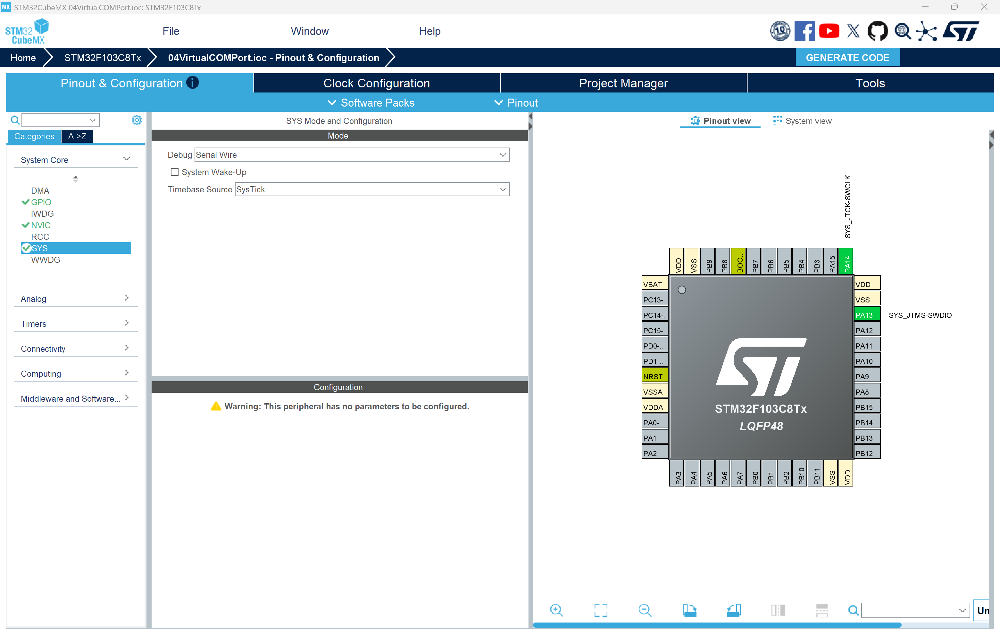
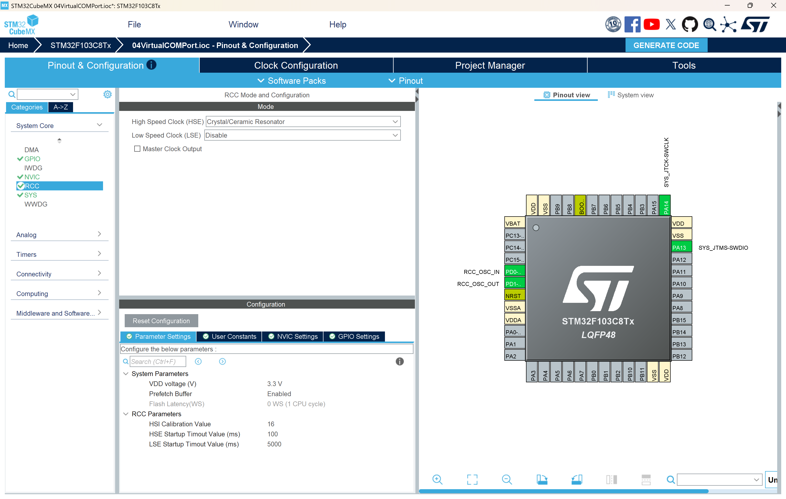
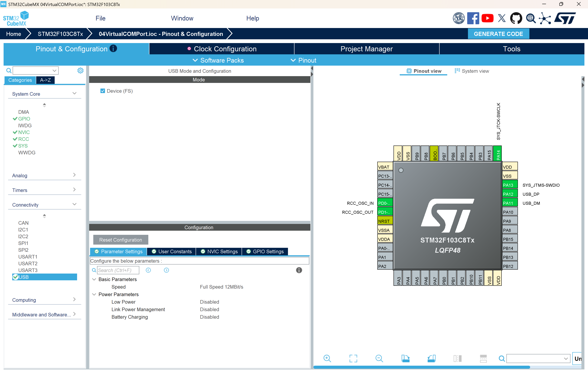
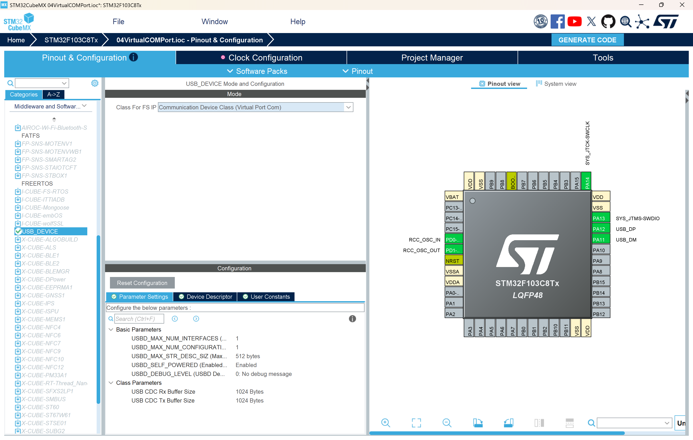
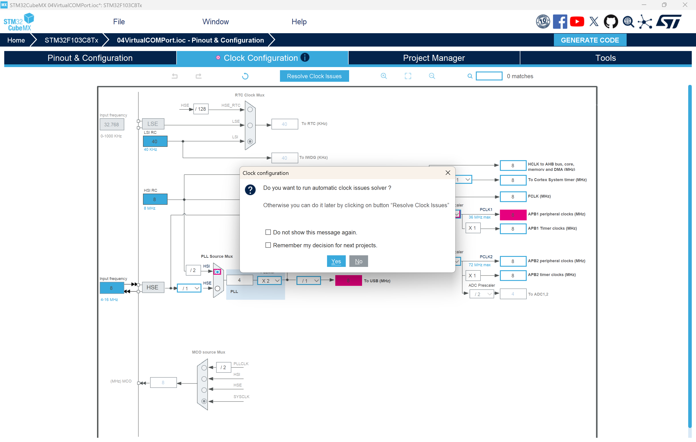
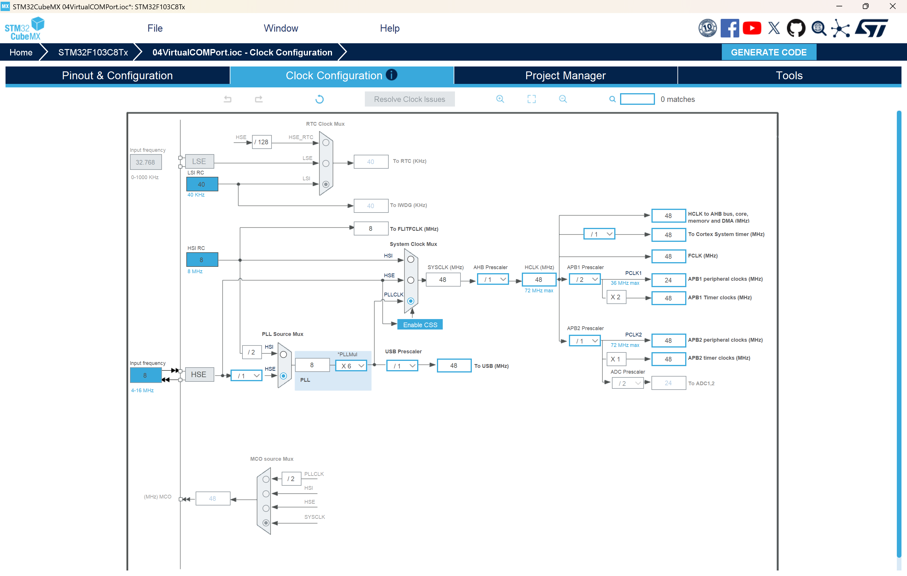

# 作业4：STM32 USB 虚拟串口通信实验

## 统一作业说明

### 学生需要完成的核心任务

1. 使用 STM32CubeMX 完成 USB Device CDC、时钟树、调试接口等配置，并保留 `.ioc` 文件。
2. 基于 HAL 与 USB CDC 中间件实现虚拟串口的收发功能，不得只完成单向发送。
3. 在主循环与接收回调配合下，实现至少 `help`、`ping`、`status`、`dice`、`echo <text>` 这些命令的处理。
4. 成功编译、下载并在电脑端串口调试助手中验证枚举、发送、接收和命令交互。
5. 在实验报告中说明 USB 时钟配置、代码结构、实验现象、问题排查和课后思考。
6. 按 [00Template/README.md](../00Template/README.md) 中提供的 LaTeX 模板撰写中文实验报告并提交 PDF。

### 本次作业验收目标

| 项目 | 要求 |
|------|------|
| 处理器平台 | STM32F103C8T6 或课程指定的带 USB 开发板 |
| 通信方式 | USB CDC 虚拟串口 |
| 必做功能 | 电脑枚举识别 COM 口，STM32 能主动发送并响应命令 |
| 理论要求 | 能解释 48 MHz USB 时钟、CDC 接收回调、主循环命令处理 |
| 验收方式 | 现场演示或结果截图，能展示串口助手中的收发记录 |

### 本次必须提交的内容

1. 可编译的完整工程目录。
2. 一份 PDF 格式实验报告。
3. 设备管理器识别截图、串口调试助手交互截图、关键代码截图各至少 1 张。
4. 课后思考题的书面回答。

### 报告必须回答的问题

1. 为什么 USB 外设时钟必须精确到 48 MHz。
2. 为什么不建议在 `CDC_Receive_FS` 回调中直接处理复杂业务。
3. 当前“单缓冲区 + 标志位”的接收方案有什么优点和局限。
4. 主循环与接收回调之间为什么要考虑共享数据保护。

## 1. 实验目的

本实验基于 STM32 的 USB CDC 类实现虚拟串口通信，要求学生完成从 CubeMX 配置、代码生成、程序编写到上位机验证的完整实验流程。通过本实验，你应掌握以下内容：

1. 理解 USB 虚拟串口（Virtual COM Port, VCP）的基本原理。
2. 掌握 STM32CubeMX 中 USB Device CDC 的配置方法。
3. 学会在 STM32 工程中使用 CDC_Transmit_FS 完成数据发送。
4. 学会在接收回调函数中获取上位机发来的数据，并在主循环中完成命令处理。
5. 能够配合电脑端串口调试助手完成实验验证、现象记录与结果分析。

## 2. 实验环境

### 2.1 硬件环境

1. 一块带 USB 接口的 STM32 开发板。
2. 一根可正常传输数据的 USB 数据线。
3. ST-Link 下载器或板载调试器。

### 2.2 软件环境

1. STM32CubeMX。
2. VS Code 或其他支持该工程的 STM32 开发环境。
3. ARM GCC / CMake 工具链或等效编译环境。
4. 串口调试助手。
5. ST-Link 驱动。

## 3. STM32CubeMX 配置步骤

下面的步骤必须保留在实验报告中，因为它们是本实验成功的前提条件。你不仅要会“照着做”，还要理解每一步为什么这样设置。

### 3.1 新建工程并选择芯片

打开 STM32CubeMX，点击 ACCESS TO MCU SELECTOR，根据你使用的开发板或芯片型号选择对应的 STM32 器件。

### 3.2 配置调试接口（SYS）

在 Pinout & Configuration 页面中，找到 SYS，将 Debug 设置为 Serial Wire。

这样做的原因是：

1. 便于后续通过 ST-Link 下载和调试程序。
2. 如果未正确配置调试接口，后续可能出现芯片无法正常调试的问题。



### 3.3 配置高速外部时钟（RCC）

在 RCC 配置项中，将 High Speed Clock (HSE) 设置为 Crystal/Ceramic Resonator。

这样做的目的是为 PLL 和 USB 提供稳定时钟来源。



### 3.4 启用 USB 外设（Connectivity）

在左侧 Connectivity 菜单下找到 USB，部分芯片上显示为 USB_OTG_FS。将其配置为 Device_Only 或 Device (FS)。

此步骤的作用是启用芯片的 USB 设备功能，使 STM32 作为一个 USB 外设被电脑识别。



### 3.5 配置 USB 中间件（Middleware）

在 Middleware and Software Packs 中打开 USB_DEVICE，将 Class for FS IP 设置为 Communication Device Class (Virtual Port Com)。

这一步的意义在于：

1. 告诉 CubeMX 当前 USB 设备要工作在 CDC 类。
2. 生成 USB 虚拟串口所需的描述符、接口文件和中间件代码。



### 3.6 配置时钟树（Clock Configuration）

这是 USB 虚拟串口实验最关键的一步。USB 外设通常要求精确的 48MHz 时钟。如果这里配置错误，电脑可能无法识别设备，或者识别后通信异常。

进入 Clock Configuration 页面后，如果弹出自动配置提示，可以选择自动配置。



随后检查 PLL 与 USB 时钟分配结果，确保 USB 时钟精确为 48MHz。



### 3.7 配置工程并生成代码

在 Project Manager 页面中：

1. 设置工程名称与保存路径。
2. 选择对应的开发环境或工具链。
3. 在 Code Generator 选项中勾选将外设初始化代码分离为独立的 c/h 文件，便于管理。
4. 点击 GENERATE CODE 生成工程。

### 3.8 配置工具链为 CMake

如果你希望在 VS Code 环境中继续使用当前工程，建议将工具链选择为 CMake，这样与本仓库的工程结构更加一致，也更方便后续在 VS Code 中编译和维护。

## 4. 硬件连接要点

1. USB_DP 与 USB_DM 通常分别连接到 PA12 和 PA11，对应 USB 连接器的 D+ 与 D-。
2. 对于部分 STM32F1 系列芯片，可能需要确认 D+ 上拉电阻相关硬件设计是否满足 USB 枚举要求。
3. USB 线必须是数据线，不能只用供电线，否则电脑无法识别虚拟串口。

## 5. 电脑端驱动与串口助手准备

1. Windows 10/11 一般会自动识别 USB CDC 虚拟串口。
2. 较老系统如 Windows 7/8 可能需要手动安装 ST 官方驱动。
3. 打开设备管理器，在端口（COM 和 LPT）中查看新出现的虚拟串口号。
4. 打开串口调试助手，选择对应 COM 口即可进行测试。

建议在实验报告中把电脑端准备过程写得更具体，至少应包括以下内容：

1. 将开发板通过 USB 数据线连接到电脑后，打开设备管理器。
2. 展开端口（COM 和 LPT），找到新出现的设备名称，常见显示方式为 USB Serial Device (COMx) 或 ST 的虚拟串口设备。
3. 记录其中的 COM 口编号，例如 COM3、COM5、COM7，后续在串口调试助手中选择同名端口。
4. 如果插拔开发板前后端口列表发生变化，可以通过“插上设备后新增的那个端口”来判断哪一个是当前开发板对应的虚拟串口。

串口调试助手建议配置如下：

1. 端口号：选择设备管理器中识别到的 COM 口，例如 COM5。
2. 波特率：建议选择 115200。
3. 数据位：8 位。
4. 校验位：无校验（None）。
5. 停止位：1 位。
6. 流控：无（None）。
7. 发送行结束符：建议使用 CRLF，也就是回车换行 \r\n，这样更方便和本实验中的命令解析逻辑匹配。
8. 接收显示：可勾选“追加换行”或“自动换行显示”，便于观察返回结果。

说明：虽然串口调试助手通常要求设置波特率、数据位、校验位和停止位，但对于 USB CDC 虚拟串口，这些参数通常不会像传统 UART 那样真正决定底层 USB 传输速率。不过为了保证串口助手界面配置统一、实验报告书写规范，以及避免部分软件因参数异常而无法正常打开端口，仍建议统一使用 115200、8 位数据位、无校验、1 位停止位，即常见的 115200 8N1 配置。

如果设备管理器中没有看到新的 COM 口，应重点检查以下问题：

1. 使用的 USB 线是否为数据线，而不是仅供电线。
2. 开发板是否已经成功下载并运行了包含 USB CDC 功能的程序。
3. CubeMX 中 USB_DEVICE 的 CDC 类是否正确启用。
4. USB 时钟是否正确配置为 48MHz。
5. 当前系统是否缺少对应驱动。

## 6. 本工程实现的实验内容

当前工程在代码中实现了一个简单的 USB 虚拟串口命令交互示例，功能如下：

1. 板子启动后输出欢迎信息。
2. 每隔一段时间输出一次 Heartbeat 信息，表示系统运行正常。
3. 上位机发送命令后，STM32 对命令进行解析并返回结果。
4. 支持的命令包括：help、ping、status、dice、echo 文本。

这样的设计比单纯的“发送 Hello”更适合作为课程实验，因为它同时覆盖了：

1. 主动发送。
2. 被动接收。
3. 命令解析。
4. 主循环与中断回调配合。

## 7. 核心代码说明

这一部分把本次实验中真正修改过的源码放到文档中，并逐段解释其含义。对于课程作业来说，不能只写“调用了某个函数”，而应说明：

1. 代码写在什么文件中。
2. 这段代码解决了什么问题。
3. 为什么要这样写，而不是更简单地直接调用函数。

### 7.1 main.c 中新增的头文件、变量与函数声明

```c
#include "usbd_cdc_if.h"
#include <stdio.h>
#include <string.h>

static uint32_t s_lastHeartbeatTick = 0;
static uint32_t s_heartbeatCounter = 0;

static uint8_t USB_SendString(const char *text);
static void USB_ProcessCommand(char *cmdLine);
```

代码解析：

1. usbd_cdc_if.h 头文件提供了 CDC_Transmit_FS、接收缓冲区和接收标志位等接口声明。
2. stdio.h 用于 snprintf，把数值格式化成字符串后再发送到上位机。
3. string.h 用于 strlen、strcmp、memcpy 等字符串操作。
4. s_lastHeartbeatTick 用于记录上一次心跳发送的时间。
5. s_heartbeatCounter 用于统计系统已经输出了多少次心跳。
6. USB_SendString 是发送封装函数，用于提高发送稳定性。
7. USB_ProcessCommand 是命令处理函数，用于解析上位机发送的字符串命令。

编程技巧：

1. 将“发送逻辑”和“命令处理逻辑”拆分成独立函数，可以让 main 函数保持简洁。
2. 使用 static 修饰内部函数和内部变量，可以限制其作用域在当前文件内，减少命名冲突。

### 7.2 main.c 中的发送函数 USB_SendString

```c
static uint8_t USB_SendString(const char *text)
{
	uint16_t len = (uint16_t)strlen(text);
	uint32_t startTick = HAL_GetTick();

	while (CDC_Transmit_FS((uint8_t *)text, len) == USBD_BUSY)
	{
		if ((HAL_GetTick() - startTick) > 100)
		{
			return USBD_BUSY;
		}
		HAL_Delay(1);
	}

	return USBD_OK;
}
```

代码解析：

1. 先通过 strlen 计算字符串长度。
2. startTick 记录当前时刻，用于后续超时判断。
3. CDC_Transmit_FS 是 USB CDC 的发送函数，但它不保证每次调用都成功。
4. 当 USB 底层仍在发送上一包数据时，CDC_Transmit_FS 会返回 USBD_BUSY。
5. 因此程序在 while 循环中等待发送资源空闲。
6. 如果等待超过 100ms，函数直接返回 USBD_BUSY，避免程序长时间卡住。
7. 如果发送成功，返回 USBD_OK。

为什么不能直接写成一行发送：

```c
CDC_Transmit_FS((uint8_t *)text, len);
```

因为 USB CDC 是异步发送接口，如果上一次发送还没有结束，下一次立刻发送很可能失败。这类问题在实验早期最常见，现象通常是“有时能发，有时不能发”。

### 7.3 main.c 中的命令解析函数 USB_ProcessCommand

```c
static void USB_ProcessCommand(char *cmdLine)
{
	size_t len = strlen(cmdLine);
	const char *echoText;
	char txBuf[160];

	while (len > 0 && (cmdLine[len - 1] == '\r' || cmdLine[len - 1] == '\n'))
	{
		cmdLine[len - 1] = '\0';
		len--;
	}

	if (len == 0)
	{
		return;
	}

	if (strcmp(cmdLine, "help") == 0)
	{
		USB_SendString("Commands: help, ping, status, dice, echo <text>\r\n");
	}
	else if (strcmp(cmdLine, "ping") == 0)
	{
		USB_SendString("pong\r\n");
	}
	else if (strcmp(cmdLine, "status") == 0)
	{
		int n = snprintf(txBuf, sizeof(txBuf),
										 "Uptime: %lu ms, Heartbeat: %lu\r\n",
										 HAL_GetTick(), s_heartbeatCounter);
		if (n > 0)
		{
			USB_SendString(txBuf);
		}
	}
	else if (strcmp(cmdLine, "dice") == 0)
	{
		uint32_t diceValue = (HAL_GetTick() % 6UL) + 1UL;
		int n = snprintf(txBuf, sizeof(txBuf), "Dice: %lu\r\n", diceValue);
		if (n > 0)
		{
			USB_SendString(txBuf);
		}
	}
	else if (strncmp(cmdLine, "echo ", 5) == 0)
	{
		echoText = &cmdLine[5];
		if (*echoText == '\0')
		{
			USB_SendString("Usage: echo <text>\r\n");
		}
		else
		{
			int n = snprintf(txBuf, sizeof(txBuf), "Echo: %s\r\n", echoText);
			if (n > 0)
			{
				USB_SendString(txBuf);
			}
		}
	}
	else
	{
		int n = snprintf(txBuf, sizeof(txBuf), "Unknown command: %s\r\n", cmdLine);
		if (n > 0)
		{
			USB_SendString(txBuf);
		}
	}
}
```

代码解析：

1. len 用于记录当前命令字符串长度。
2. txBuf 是发送缓冲区，用于保存格式化后的返回消息。
3. while 循环用于去掉命令末尾的回车和换行符。
4. 这一步很有必要，因为串口调试助手发送命令时，通常会附带回车或回车换行。
5. 如果去掉结尾字符后长度为 0，说明用户只按了回车，不需要处理。
6. strcmp 用于判断命令内容。
7. help 命令返回支持的命令列表。
8. ping 命令返回 pong，用于验证最基本的双向通信。
9. status 命令通过 snprintf 拼接运行时间和心跳计数。
10. dice 命令根据系统节拍生成 1 到 6 的点数，能让实验结果更有交互感。
11. echo 命令会把用户输入的文本原样返回，便于观察字符串接收与回传效果。
12. 对于未知命令，返回 Unknown command，便于用户定位输入错误。

编程技巧：

1. 先做输入清洗，再做命令判断，是常见的命令行处理方式。
2. 使用 snprintf 比 sprintf 更安全，因为它可以限制写入长度。
3. 使用 else if 链适合实验阶段的少量命令，后续命令多了可以改成查表或状态机。

### 7.4 main.c 中的初始化阶段代码

```c
MX_GPIO_Init();
MX_USB_DEVICE_Init();

HAL_Delay(1200);
USB_SendString("\r\n===== STM32 USB CDC Demo =====\r\n");
USB_SendString("Type 'help' and press Enter.\r\n");
```

代码解析：

1. MX_GPIO_Init 初始化 GPIO 外设。
2. MX_USB_DEVICE_Init 初始化 USB Device 中间件与 CDC 类。
3. HAL_Delay(1200) 的目的是给 USB 枚举预留一点时间。
4. 如果设备刚初始化完成就立即发送数据，电脑端可能尚未完成枚举，导致首条信息发送失败。
5. 欢迎信息是实验调试中非常重要的“可观测信号”，只要一打开串口助手就能看到系统是否正常启动。

### 7.5 main.c 中的主循环核心代码

```c
while (1)
{
	if ((HAL_GetTick() - s_lastHeartbeatTick) >= 1000)
	{
		char heartbeatMsg[64];
		s_lastHeartbeatTick = HAL_GetTick();
		s_heartbeatCounter++;

		if ((s_heartbeatCounter % 5UL) == 0UL)
		{
			int n = snprintf(heartbeatMsg, sizeof(heartbeatMsg),
											 "Heartbeat %lu\r\n", s_heartbeatCounter);
			if (n > 0)
			{
				USB_SendString(heartbeatMsg);
			}
		}
	}

	if (g_usbRxFlag != 0U)
	{
		uint32_t rxLen;
		char cmdBuf[APP_RX_DATA_SIZE + 1U];

		__disable_irq();
		rxLen = g_usbRxLength;
		if (rxLen > APP_RX_DATA_SIZE)
		{
			rxLen = APP_RX_DATA_SIZE;
		}
		memcpy(cmdBuf, g_usbRxBuffer, rxLen);
		g_usbRxFlag = 0U;
		g_usbRxLength = 0U;
		__enable_irq();

		cmdBuf[rxLen] = '\0';
		USB_ProcessCommand(cmdBuf);
	}
}
```

代码解析：

1. 主循环第一部分负责周期任务，也就是心跳输出。
2. HAL_GetTick 返回系统运行毫秒数，可用于实现非阻塞定时。
3. 每过 1000ms，心跳计数加 1。
4. 每累计 5 次心跳，向上位机发送一次 Heartbeat 文本。
5. 这样做的目的不是频繁刷屏，而是让上位机定期看到系统仍在正常运行。
6. 主循环第二部分检查 g_usbRxFlag，这个标志由 USB 接收回调置位。
7. 当有新数据时，先进入临界区，读取长度并把共享缓冲区拷贝到本地变量中。
8. 随后清除接收标志和长度，再退出临界区。
9. 最后手动在字符串末尾补上 '\0'，使其成为合法 C 字符串。
10. 调用 USB_ProcessCommand 完成命令解析。

为什么这里要使用临界区：

1. g_usbRxFlag、g_usbRxLength、g_usbRxBuffer 都可能在中断回调中被修改。
2. 如果主循环读取到一半，USB 中断恰好又写入新数据，就可能出现数据不一致。
3. 因此这里使用 __disable_irq 和 __enable_irq 做最小范围保护。

### 7.6 usbd_cdc_if.h 中新增的共享变量声明

```c
extern volatile uint8_t g_usbRxFlag;
extern volatile uint32_t g_usbRxLength;
extern uint8_t g_usbRxBuffer[APP_RX_DATA_SIZE];
```

代码解析：

1. g_usbRxFlag 表示是否收到一帧新的 USB 数据。
2. g_usbRxLength 记录当前接收到的数据长度。
3. g_usbRxBuffer 用于保存从上位机发来的原始数据。
4. extern 表示这些变量定义在别的 c 文件中，这里只是声明，供 main.c 使用。
5. volatile 的作用是告诉编译器，这些变量可能被中断或硬件异步修改，不能随意优化缓存。

这是嵌入式开发中非常基础但又非常容易忽略的一点。凡是由中断修改、主循环读取的状态变量，都应认真考虑是否需要 volatile。

### 7.7 usbd_cdc_if.c 中新增的共享变量定义

```c
volatile uint8_t g_usbRxFlag = 0;
volatile uint32_t g_usbRxLength = 0;
uint8_t g_usbRxBuffer[APP_RX_DATA_SIZE];
```

代码解析：

1. 这里是变量真正分配存储空间的地方。
2. 初值都设置为 0，表示系统启动时还没有接收到任何数据。
3. 缓冲区大小使用 APP_RX_DATA_SIZE，和 USB CDC 配置保持一致。

### 7.8 usbd_cdc_if.c 中的接收回调函数

```c
static int8_t CDC_Receive_FS(uint8_t* Buf, uint32_t *Len)
{
	uint32_t rxLen = *Len;

	if (rxLen > APP_RX_DATA_SIZE)
	{
		rxLen = APP_RX_DATA_SIZE;
	}

	memcpy(g_usbRxBuffer, Buf, rxLen);
	g_usbRxLength = rxLen;
	g_usbRxFlag = 1;

	USBD_CDC_SetRxBuffer(&hUsbDeviceFS, &Buf[0]);
	USBD_CDC_ReceivePacket(&hUsbDeviceFS);
	return (USBD_OK);
}
```

代码解析：

1. Buf 指向 USB 底层收到的数据缓冲区。
2. Len 记录本次接收到的数据长度。
3. 先把长度取出来保存到 rxLen，便于后续处理。
4. 如果长度超过应用缓冲区大小，就截断到 APP_RX_DATA_SIZE，防止越界。
5. memcpy 把 USB 收到的数据复制到应用层自己的缓冲区 g_usbRxBuffer。
6. 保存长度到 g_usbRxLength。
7. 设置 g_usbRxFlag = 1，通知 main.c 主循环“有新数据可以处理”。
8. 调用 USBD_CDC_SetRxBuffer 设置接收缓冲区。
9. 调用 USBD_CDC_ReceivePacket 重新开启下一次 USB 接收。

这里最重要的编程思想是“中断里只搬运数据，不做复杂业务”。

如果在这个回调里直接做大量字符串比较、格式化输出甚至复杂协议解析，会带来以下风险：

1. 回调执行时间变长。
2. 影响 USB 协议层继续收包。
3. 程序结构混乱，不利于扩展。

### 7.9 代码结构的整体工作流程

本实验代码可以概括为下面 5 个步骤：

1. 系统启动后初始化 USB CDC。
2. STM32 向电脑发送欢迎信息。
3. 电脑通过串口调试助手发送命令。
4. USB 接收回调把数据存入缓冲区并置位标志。
5. 主循环读取数据并解析命令，然后返回处理结果。

这就是一个典型的“中断采集数据，主循环处理业务”的嵌入式软件结构。它简单、稳定，非常适合作为课程实验与后续扩展的基础框架。

## 8. 当前示例支持的命令

### 8.1 help

显示支持的命令列表。

### 8.2 ping

返回 pong，用于验证双向通信正常。

### 8.3 status

返回系统运行时间与心跳计数，用于查看程序运行状态。

### 8.4 dice

返回一个 1 到 6 的随机点数，用于增强实验交互性。

### 8.5 echo <text>

回显用户输入的文本，用于验证接收缓存与字符串处理是否正常。

## 9. 编程技巧总结

1. 接收回调中少做事，把复杂处理放到主循环。
2. 与中断共享的变量应使用 volatile 修饰。
3. 读取共享缓冲区时要考虑临界区保护，防止数据被中断同时修改。
4. 发送函数要考虑忙状态，不能无条件连续发送。
5. 实验代码最好具备“可观测性”，例如欢迎信息、心跳包、状态命令，这样更便于调试。

## 10. 实验操作步骤

### 10.1 编译工程

使用你当前的开发环境编译工程，确认无编译错误。

### 10.2 烧录程序

通过 ST-Link 将程序下载到 STM32 开发板。

### 10.3 连接电脑

使用 USB 数据线将开发板连接到电脑，等待系统识别虚拟串口。

### 10.4 查看 COM 口

打开设备管理器，确认端口列表中出现新的虚拟串口设备。

### 10.5 打开串口调试助手

在串口调试助手中：

1. 选择对应 COM 口。
2. 打开串口。
3. 观察是否收到欢迎信息。

### 10.6 输入测试命令

依次发送以下命令并观察返回结果：

1. help
2. ping
3. status
4. dice
5. echo hello stm32
6. 自定义未知命令，例如 abc

### 10.7 记录实验结果

建议在实验报告中保留以下截图：

1. CubeMX 配置截图。
2. 设备管理器中虚拟串口截图。
3. 串口调试助手中的欢迎信息截图。
4. help、ping、status、dice、echo 命令响应截图。
5. 未知命令测试截图。

## 11. 实验现象与结果分析

如果实验成功，你应看到如下现象：

1. 电脑成功识别到一个新的 COM 口。
2. 打开串口助手后，STM32 自动输出欢迎信息。
3. 程序周期性输出 Heartbeat 信息。
4. 向 STM32 发送命令后，能够收到对应返回值。

更具体地说，实验过程中通常会观察到以下现象：

1. 串口打开后，窗口首先显示类似下面的欢迎信息：

```text
===== STM32 USB CDC Demo =====
Type 'help' and press Enter.
```

2. 如果程序持续稳定运行，每隔约 5 秒会收到一次 Heartbeat 信息，例如 Heartbeat 5、Heartbeat 10、Heartbeat 15。这说明主循环没有卡死，USB 发送链路仍然可用。
3. 发送 help 命令后，串口助手会返回当前支持的命令列表。这说明命令解析分支已经进入正确路径。
4. 发送 ping 命令后，STM32 会立即返回 pong。这个现象最适合用来证明“上位机发送成功，开发板接收成功，开发板处理完成后又成功回传”。
5. 发送 status 命令后，会返回当前运行时间和心跳计数，例如 Uptime: 18342 ms, Heartbeat: 18。该现象说明程序能够在主循环中持续运行，并能把内部状态格式化后发送给上位机。
6. 发送 dice 命令后，会返回 Dice: 1 到 Dice: 6 之间的某个结果。虽然这里不是严格随机数，但对课程实验来说，它足以展示“同一个命令可产生不同返回结果”的交互特性。
7. 发送 echo hello stm32 后，会返回 Echo: hello stm32。这个现象说明接收缓冲区中的字符串被完整取出，并经过简单解析后重新发送出来。
8. 如果输入一个未定义命令，例如 abc，程序会返回 Unknown command: abc。这说明异常输入路径也得到了处理，程序不会因为非法命令而无响应。

从实验报告书写角度，可以把这些现象分别对应为以下结论：

1. 能识别 COM 口，说明 USB 枚举成功。
2. 能收到开机欢迎信息，说明 CDC 发送初始化基本正常。
3. 能稳定看到 Heartbeat，说明系统主循环在持续执行。
4. ping 和 echo 能正常返回，说明 CDC 接收链路与命令解析链路正常。
5. status 能返回运行时间和计数值，说明应用层状态变量工作正常。
6. dice 能产生变化结果，说明程序不仅能固定回复，还能根据当前运行状态生成不同输出。

这些现象说明：

1. USB 枚举成功。
2. CDC 发送功能正常。
3. CDC 接收功能正常。
4. 应用层命令解析逻辑正常。

## 12. 常见问题排查

| 问题 | 可能原因与解决方案 |
| :--- | :--- |
| 电脑无法识别设备 | 检查 USB 时钟是否为 48MHz；检查 USB 线是否为数据线；检查硬件连线是否正确；检查程序是否已正常运行。 |
| 有 COM 口但没有输出 | 检查是否调用了 MX_USB_DEVICE_Init；检查上电后是否给了 USB 足够的枚举时间；检查发送函数是否因忙状态失败。 |
| 输入命令没有响应 | 检查串口助手是否发送了回车换行；检查接收标志位与缓冲区逻辑是否正常；检查回调中是否重新开启接收。 |
| 连续发送时偶发失败 | 说明 CDC 发送接口处于忙状态，应做重试、延时或发送队列处理。 |
| clear 命令没有清屏 | 说明串口助手不支持 ANSI 控制序列，这不是 STM32 程序错误。 |

## 13. 课后思考题

请结合本次实验，在报告中认真回答以下问题：

1. USB CDC 与传统 UART 串口通信在原理和使用方式上有什么区别？
2. 为什么 USB 外设时钟必须精确配置为 48MHz？
3. 为什么不建议在 CDC_Receive_FS 回调函数中直接做复杂业务处理？
4. 当前代码使用的是“单缓冲区 + 标志位”方式接收数据，这种方法有哪些优点和局限？
5. 如果要支持更长的数据帧或连续高速输入，应如何优化当前程序结构？
6. 如果要把本实验扩展为“通过上位机命令控制 LED 闪烁频率”，你会如何设计命令格式与程序流程？

## 14. 实验报告提交要求

### 14.1 报告建议结构

1. 封面：课程名称、作业名称、姓名、学号、班级、日期。
2. 作业目标：简述本实验需要实现的通信功能与验收指标。
3. 实验环境：开发板型号、USB 连接方式、调试器、软件版本、上位机工具。
4. CubeMX 配置：必须说明 SYS、RCC、USB、USB_DEVICE、Clock Configuration 的关键设置及其原因。
5. 程序设计：至少分析 `main.c` 中的初始化和主循环逻辑，以及 `usbd_cdc_if.c` 中的接收回调逻辑。
6. 程序流程图：必须展示“USB 接收 -> 缓冲区搬运 -> 主循环解析 -> 返回结果”的流程。
7. 实验步骤：包括编译、下载、连接电脑、识别 COM 口、串口助手测试命令等过程。
8. 实验结果：必须展示设备管理器识别结果、欢迎信息、命令交互结果和异常命令测试结果。
9. 问题分析与调试记录：说明遇到的枚举失败、发送忙、无回显等问题及排查方法。
10. 课后思考题答案：必须完整回答本 README 中 6 个思考题。
11. 总结：概括你对 USB CDC 通信、任务划分和调试方法的理解。
12. 附录：可附核心代码、更多截图、参考资料。

### 14.2 图片与流程图要求

1. 报告中至少包含 4 类图片：CubeMX 配置截图、设备管理器截图、串口调试助手截图、实验结果或调试截图。
2. 每张图片必须标注图号和图题，并在正文中说明该图用于证明什么现象。
3. 程序流程图必须单独成图，不能只用文字描述替代。
4. 若使用额外调试工具，如逻辑分析仪、串口日志或视频录屏，可作为附录或加分材料。

### 14.3 提交规范

1. 报告文件建议命名为：`学号-姓名-作业4-STM32USB虚拟串口实验.pdf`。
2. 若实验未完全成功，也必须提交完整报告，重点说明失败现象、原因分析和改进方向。
3. 报告中不能只贴代码或截图，必须结合现象进行解释。

### 14.4 最低验收标准

1. 电脑能够识别出虚拟串口设备。
2. STM32 能主动发送欢迎信息或心跳信息。
3. 上位机发送命令后能够收到正确响应。
4. 报告能够解释接收回调与主循环协作关系。

## 15. 可进一步扩展的方向

1. 增加 LED 控制命令。
2. 增加 printf 重定向到 USB CDC。
3. 使用环形缓冲区替代当前单缓冲结构。
4. 增加简单通信协议，如帧头、长度、校验位。

## 16. 总结

本实验不是单纯完成一次“USB 能发出字符串”的演示，而是要你掌握完整的嵌入式通信开发流程：先配置硬件与时钟，再生成底层框架，之后编写应用层逻辑，最后借助上位机工具完成验证与分析。只有把“配置步骤、代码结构、调试方法、实验结果”完整串起来，才算真正完成这次作业。